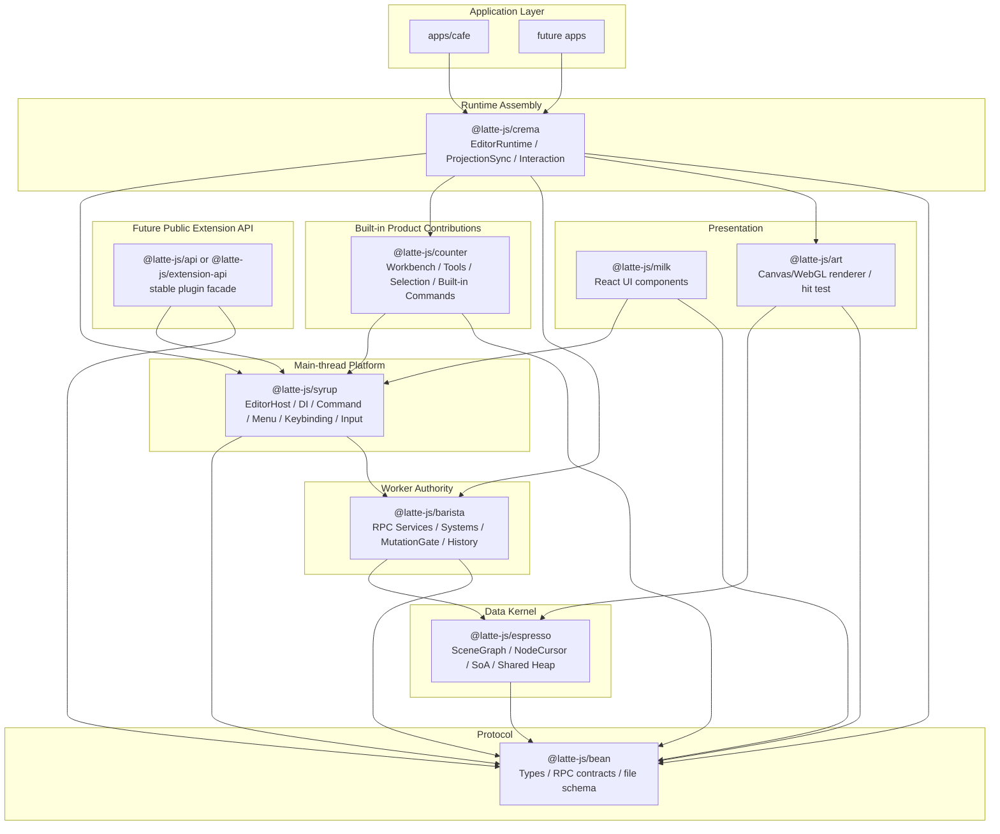
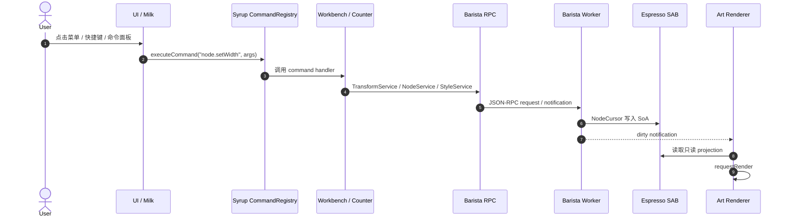
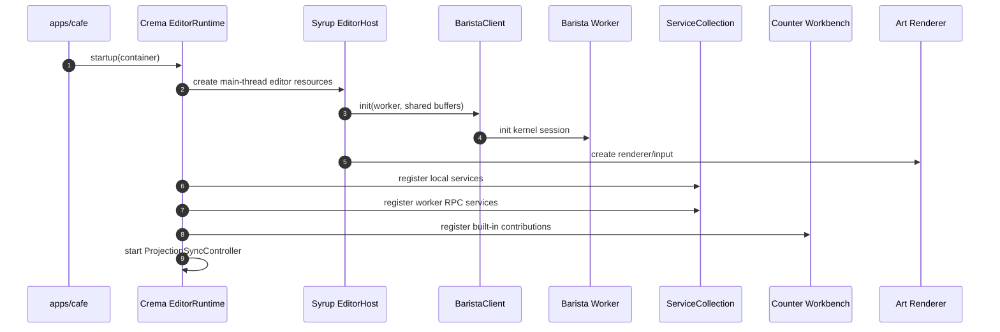
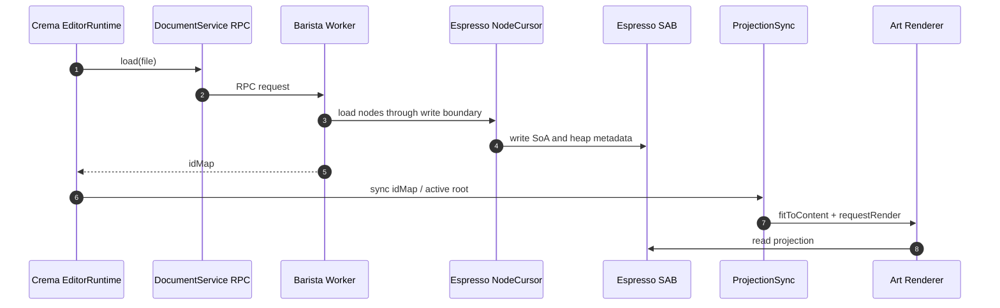
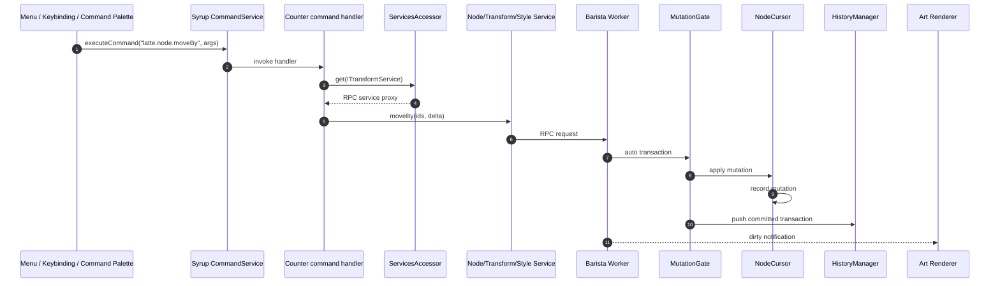
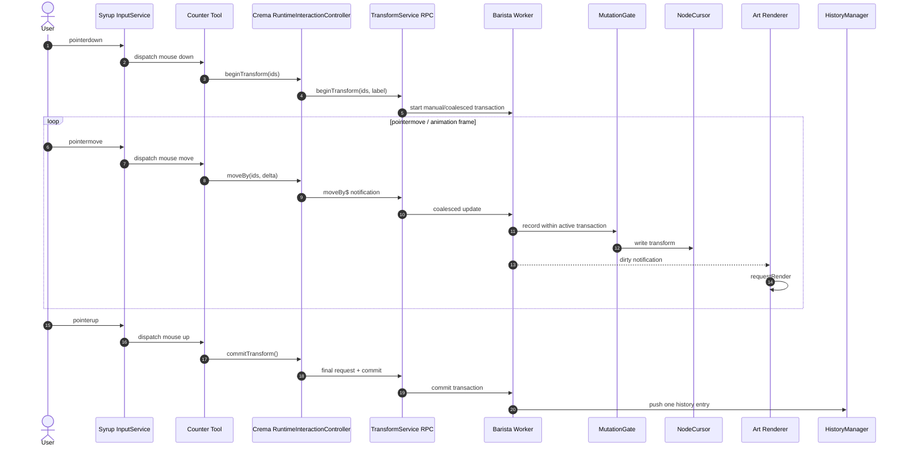

# Latte Architecture Blueprint

> 日期：2026-06-05
>
> 目标：将 Latte 演进为兼具 Figma 画布编辑能力与 VSCode 工程化/扩展架构的编辑器平台。

本文档是旧版 Latte Architecture Blueprint 的更新版。

它不要求当前代码完全回到旧文档，而是基于当前已经形成的
`SharedArrayBuffer + SoA + Worker 权威写入 + 主线程只读投影`
路线，重新划分 `syrup`、`crema`、`counter/workbench`、`barista`
和未来插件 API 的职责。

## 1. 总体结论

旧版文档中的核心方向仍然成立：

- `bean` 作为协议与类型契约。
- `espresso` 作为 SAB + SoA 数据内核。
- `barista` 作为 worker 侧计算和写入权威。
- `art` 作为只读渲染层。
- `syrup` 提供 VSCode 风格的主线程基础设施。
- `workbench` 承载内置工具、命令和业务贡献。
- `milk` 承载 React UI 组件。

但当前更合理的架构不再是单纯的：

```text
UI -> Command -> Workbench -> Barista -> Memory
```

而应该升级为：

```text
UI / Input / Keybinding / Plugin
  -> Command as user-intent entry
  -> Workbench contribution
  -> Service as domain capability
  -> RPC or local implementation
  -> Worker mutation authority
  -> Shared projection
  -> Renderer / UI readback
```

关键变化是：Command 是用户意图入口，不是所有内部调用的唯一通道。
Service 是能力边界，可以来自主线程本地，也可以来自 worker RPC。

## 2. VSCode 对照：高频操作是否必须走 Commands

VSCode 的整体思路是：

- 快捷键、菜单、命令面板、扩展显式动作通常进入 Command Registry。
- 扩展作者面对的是 `vscode.commands.registerCommand/executeCommand`
  和稳定的 extension API facade。
- 内部 workbench/editor 代码大量通过 DI 获取 service，并不要求所有内部路径都串成 command。
- 编辑器内部的鼠标拖拽、选择更新等高频交互由 controller 直接处理，
  不会把每一帧 mousemove 都包装为 `executeCommand`。

可参考 VSCode 源码：

- Command Registry：
  <https://github.com/microsoft/vscode/blob/main/src/vs/platform/commands/common/commands.ts>
- Extension API 中暴露的 `vscode.commands`：
  <https://github.com/microsoft/vscode/blob/main/src/vs/workbench/api/common/extHost.api.impl.ts>
- Editor mouse drag path：
  <https://github.com/microsoft/vscode/blob/main/src/vs/editor/browser/controller/mouseHandler.ts>

因此 Latte 也不应把高频移动、旋转、缩放的每一帧都建模为 command。
更合理的规则是：

- 一次性用户动作：注册 command。
- 高频连续交互：command 或 tool 激活交互 session，帧内更新直接走 service/controller。
- 领域能力：放在 service，例如 `NodeService`、`TransformService`、`StyleService`。
- worker 写入：最终收口到 worker service、MutationGate、NodeCursor。

## 3. 模块层级架构

### 3.1 目标 Coffee Stack



### 3.2 包职责

| 包 | 定位 | 应该包含 | 不应该包含 |
| --- | --- | --- | --- |
| `bean` | 协议层 | 类型、RPC service contract、文件 schema 类型 | 运行时逻辑、UI、worker 实现 |
| `espresso` | 数据内核 | SceneGraph、NodeCursor、SoA、SAB、heap、loader/serializer | 业务 service、UI 状态、插件 API |
| `barista` | worker 权威执行层 | Document/Node/Transform/Style/UndoRedo service、systems、MutationGate、HistoryManager | DOM、React、主线程 input、插件公开 facade |
| `syrup` | 主线程平台层 | EditorHost、Input、Command、Menu、Keybinding、DI、ServiceCollection、本地 service 注册 | 具体工具业务、document 权威写入、插件稳定 API 全量 |
| `crema` | runtime 组装层 | 启动 worker、初始化 editor、注册本地和 RPC service、load document、projection sync | 具体业务工具、SoA 数据结构细节 |
| `counter` | workbench/内置产品贡献 | SelectionService、ToolService、SelectTool、内置命令、内置面板逻辑 | 平台 DI 内核、worker mutation 实现 |
| `art` | 渲染和命中层 | renderer、camera、hit test、只读 projection 绘制 | document 写入、事务、history |
| `milk` | UI 组件层 | React 组件、面板、控件、hooks | document 写入权威、worker 内部 service |
| `api` | 未来插件 facade | `ctx.nodes`、`ctx.commands`、`ctx.selection`、`ctx.workspace` | 内部 `Editor.getService()`、内部 service 实例直接泄漏 |

## 4. Syrup、Counter、Crema 的边界

### 4.1 Syrup：主线程平台，不是产品业务全集

`syrup` 应该类似 VSCode 的 platform/workbench infrastructure：

- `CommandService`
- `KeybindingService`
- `MenuService`
- `InputService`
- `ContextKeyService`
- `ServiceCollection`
- `InstantiationService`
- `EditorHost`
- local service registration
- worker RPC service registration

`syrup` 不应该知道“选择工具如何画框”“矩形工具如何创建节点”“属性面板如何改 fill”。
这些属于产品贡献。

### 4.2 Counter：当前更接近 Workbench

当前 `counter` 的定位更接近旧文档里的 `workbench`：

- 内置 selection 能力。
- 内置 tool。
- 内置 command handlers。
- 内置面板业务。
- 把工具注册到 `syrup` 的 input/command/menu/keybinding。

因此长期可以二选一：

- 保留 `counter` 名称，但在文档中明确它就是内置 workbench/contrib 包。
- 未来重命名为 `@latte-js/workbench`，让语义更贴近 VSCode。

从架构清晰度看，`workbench` 更直观；从品牌命名看，`counter` 可以继续作为产品贡献包名。
短期无需强制重命名，先把职责边界收紧更重要。

### 4.3 Crema：Runtime Assembly

`crema` 的存在是合理的。

它不应该变成业务包，而应该负责把多个内部能力装配成一个可运行 editor runtime：

```text
create Editor
  -> start worker
  -> create BaristaClient
  -> register RPC services
  -> create Renderer/Input
  -> create ProjectionSyncController
  -> register workbench contributions
  -> load document
```

这能避免 `syrup` 变成“既是平台、又是 runtime、又是产品、又是 plugin API”的大包。

## 5. 旧版运行时流程

旧文档中的流程适合表达“用户意图如何进入系统”：



这个流程仍然有效，但它不适合承载所有高频内部更新。

## 6. 新版运行时流程

### 6.1 启动与装配



### 6.2 文档加载



长期目标：主线程不再使用 loader 写 document graph。
主线程只同步 ID map、active root、dirty/version 等 projection metadata。

### 6.3 一次性命令操作



### 6.4 高频移动/旋转/缩放



关键点：

- `pointermove` 不应该每帧 `executeCommand`。
- command 可以负责激活工具或触发一次性动作。
- 连续交互期间由 Tool/InteractionController 直接调用 service。
- worker 负责自动事务、合并更新、history journal。

## 7. Command 与 Service 的关系

### 7.1 推荐规则

```text
Command = 用户意图入口
Service = 领域能力边界
Controller = 高频交互编排
System = worker 内部计算模块
Manager = worker 或 runtime 内部状态管理基础设施
```

### 7.2 调用选择

| 场景 | 推荐入口 | 示例 |
| --- | --- | --- |
| 命令面板执行对齐 | Command | `commands.execute("latte.align.left")` |
| 快捷键删除节点 | Command -> NodeService | `latte.node.delete` |
| 属性面板改宽度 | Service 或 Command 包装 | `TransformService.resizeTo(...)` |
| 插件脚本移动节点 | Public API facade | `ctx.nodes.moveBy(...)` |
| 选择工具拖拽框选 | Tool/SelectionService | 主线程 session state |
| 拖拽移动每一帧 | InteractionController -> TransformService | `moveBy$` notification |
| 鼠标抬起提交 | TransformService | `commitTransform()` |
| undo/redo | UndoRedoService | worker history replay |

### 7.3 为什么不能所有都走 Command

如果所有操作都强制走 command，会出现几个问题：

- 高频交互每帧 command dispatch，带来不必要的事件、日志、权限、参数处理开销。
- command 语义过宽，难以区分“用户动作”和“内部连续更新”。
- 插件 API 如果直接暴露内部 command/service，会导致未来内部重构困难。
- 主线程本地 service 与 worker RPC service 难以统一注入。
- 多 editor、多文档、多窗口场景容易被全局 command/proxy 污染。

因此正确模型是：

```text
Command exposes intent.
Service owns capability.
Controller optimizes interaction.
Worker owns mutation.
```

## 8. Service / RPC / DI 目标模型

### 8.1 注册模型

```text
ServiceCollection
  ICommandService          -> local CommandService
  IKeybindingService       -> local KeybindingService
  IMenuService             -> local MenuService
  IInputService            -> local InputService
  ISelectionService        -> local SelectionService
  IToolService             -> local ToolService
  INodeService             -> Barista RPC proxy
  ITransformService        -> Barista RPC proxy
  IStyleService            -> Barista RPC proxy
  IDocumentService         -> Barista RPC proxy
  IUndoRedoService         -> Barista RPC proxy
```

调用方只依赖 interface：

```ts
commandService.registerCommand('latte.node.moveBy', accessor => {
  const transformService = accessor.get(ITransformService)
  return transformService.moveBy(ids, delta)
})
```

调用方不应该知道 `ITransformService` 的真实实现是在主线程还是 worker。

### 8.2 当前需要收敛的点

当前 `packages/syrup/src/services/proxies/proxies.ts` 的全局 proxy 设计应淘汰。

问题：

- 依赖全局 `editor`。
- 不支持多 editor/runtime。
- 绕过 ServiceCollection。
- 把 worker channel 与主线程 service 混在一个隐式全局对象里。

目标：

- 由 `crema` 在 runtime startup 时创建并注册 RPC service proxy。
- 内置 workbench/contrib 通过 DI 获取 service。
- 外部插件通过未来 public API facade 获取稳定能力。

## 9. 插件 API 目标

长期不建议让插件作者直接调用：

```ts
editor.getService(...)
```

而应暴露稳定 facade：

```ts
export interface LatteExtensionContext {
  commands: {
    execute<T>(id: string, ...args: unknown[]): Promise<T>
    register(id: string, handler: (...args: unknown[]) => unknown): Disposable
  }

  nodes: {
    moveBy(ids: IDType[], delta: vec2): Promise<void>
    setName(id: IDType, name: string): Promise<void>
    remove(ids: IDType[]): Promise<void>
  }

  selection: {
    get(): IDType[]
    set(ids: IDType[]): void
    onDidChange(listener: (ids: IDType[]) => void): Disposable
  }

  workspace: {
    openDocument(uri: string): Promise<void>
    activeDocument: LatteDocumentRef | null
  }
}
```

Facade 内部可以调用 command，也可以调用 service。
插件作者不应关心能力来自本地、RPC、worker 还是未来 extension host。

## 10. 数据与内存布局

当前方向保持：

```text
Logical Node
  -> integer index
  -> SoA columns
  -> shared heap/blob metadata
  -> NodeCursor read/write facade
```

推荐边界：

- `espresso` 提供高性能数据结构和低层 cursor。
- `barista` 通过 service/system 调用 cursor 写入。
- `art` 和主线程 UI 只读 SAB projection。
- 字符串、JSON-like metadata 使用 shared heap/blob pointer columns。
- 文件导入、外部 RPC payload、插件 manifest 可在边界使用 runtime schema 校验。
- hot path 不做重型运行时校验。

## 11. Selection 的位置

当前 `SelectionService` 作为主线程 UI/session state 是合理的。

原因：

- 选择状态不是 document model。
- 选择变化频率高，直接放主线程更贴近 input/render overlay。
- 主线程需要立即响应 hover、selection outline、property panel。
- worker 不需要长期权威保存 selection，除非要做重计算。

后续可以增加 worker-side `SelectionContext`：

```text
Main SelectionService
  -> sync selected ids to worker
  -> worker computes bounds / OBB / snapping / resize handles
  -> writes result projection
  -> main reads projection
```

但这应作为性能需求出现后的增强，不是当前 P0/P1 必需项。

## 12. Transaction 与 History 边界

推荐模型：

```text
Worker Service Method
  -> MutationGate
  -> auto/manual transaction
  -> NodeCursor mutation records
  -> TransactionManager commit/abort
  -> HistoryManager undo/redo stacks
  -> MutationRecordApplier replay through NodeCursor
```

主线程不直接管理事务。

主线程只调用：

- `NodeService`
- `TransformService`
- `StyleService`
- `UndoRedoService`

worker 负责判断某个 service method 是否需要自动事务。
对于拖拽类连续交互，可以由 service method 或 metadata 声明手动事务边界。

## 13. 当前架构风险和下一步

### 13.1 P0

- 去掉 `Editor.hydrateDocument(data)` 中无 `idMap` 时主线程 loader 写 graph 的长期主路径。
- 淘汰 `syrup/services/proxies` 的全局 singleton proxy。
- 明确 `Editor.getService()` 是内部 host API，或替换为正式 `ServiceCollection`。
- 让 `crema` 负责注册 local services 与 worker RPC services。
- 保证 `apps/cafe` 仍然可运行、可见、无运行时错误。

### 13.2 P1

- 将 `counter` 明确整理为 workbench/contrib 包。
- 给 `SelectionService`、`ToolService`、commands 使用 DI 注册。
- 让 command handler 通过 `ServicesAccessor` 获取 service。
- 补充 `StyleService`，避免样式变更绕过统一 mutation/history。
- 建立 public API facade 草案。

### 13.3 P2

- 设计 extension host 和 sandbox。
- 建立 command 权限、插件贡献点、manifest schema。
- 建立文件 schema migration。
- 完善 e2e、性能基线、COOP/COEP 发布配置。
- 决定 `counter` 是否重命名为 `workbench`。

## 14. 推荐最终原则

```text
Syrup owns platform.
Crema owns assembly.
Counter/Workbench owns built-in product contributions.
Barista owns mutation authority.
Espresso owns data layout.
Art owns rendering.
API owns public extension surface.
Commands expose intent.
Services own capability.
Controllers handle high-frequency interaction.
```

这比旧版文档更接近 Latte 的目标：

- Figma 式高性能画布编辑。
- VSCode 式 service/command/extension 架构。
- worker 权威写入。
- 主线程稳定交互。
- 长期可商业化的 public API 边界。
