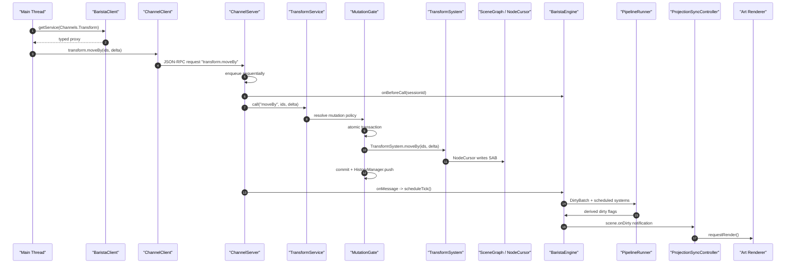

# Latte RPC / Service Architecture Review

> 日期：2026-06-09
>
> 用途：专门梳理当前 RPC、service、system、mutation、history、dirty pipeline 的真实设计，作为 review 入口文档。本文描述的是当前代码实况，同时标注了下一阶段应该收敛的方向。

## 1. 一句话模型

当前 Latte 的 RPC / service 设计可以压缩成一条链：

```text
Main Thread
  UI / Tool / Command / Runtime
  -> typed service facade
  -> BaristaClient / ChannelClient
  -> JSON-RPC over MessagePort

Worker
  ChannelServer
  -> ServiceManager
  -> ServiceBase + MutationGate
  -> Domain System
  -> SceneGraph / NodeCursor / SAB
  -> DirtyBatch / PipelineRunner
  -> scene.onDirty notification

Main Thread
  ProjectionSyncController
  -> update projection metadata / request render
  -> Art renderer reads SAB projection
```

最重要的边界是：

- `bean` 定义 RPC contract，不执行逻辑。
- `syrup / crema / counter` 在主线程发起调用。
- `barista` 在 worker 内实现 service、事务、history、派生重算。
- `espresso` 提供 SceneGraph、NodeCursor、SoA、SAB 等数据内核。
- 主线程不应该成为 document mutation 权威。

## 2. 当前 Review 入口文件

建议按这个顺序看：

| 层 | 文件 | 重点 |
| --- | --- | --- |
| 协议 | `packages/bean/src/rpc/services.ts` | `Channels` 与 `IServiceMap` 是否覆盖所有公开服务 |
| 协议 | `packages/bean/src/rpc/ipc.ts` | request / notification / listen / unlisten 消息模型 |
| 主线程 RPC | `packages/barista/src/client/baristaClient.ts` | `getService(channel)` 如何返回 typed proxy |
| 主线程 RPC | `packages/barista/src/ipc/channelClient.ts` | `$` notification、request、listen 的发送逻辑 |
| RPC proxy | `packages/barista/src/ipc/proxyChannel.ts` | `toService` / `fromService` 如何把对象映射成 channel |
| worker server | `packages/barista/src/ipc/channelServer.ts` | 顺序化消息处理、错误处理、engine-owned event |
| worker engine | `packages/barista/src/worker/baristaEngine.ts` | session、ServiceManager、MutationGate、pipeline、dirty event |
| service 注册 | `packages/barista/src/services/serviceBase.ts` | `@service`、mutation policy resolution |
| service 注册 | `packages/barista/src/services/serviceManager.ts` | service 实例化与 channel 注册 |
| mutation | `packages/barista/src/transactions/mutationPolicy.ts` | 自动事务、session 事务、history push |
| transaction | `packages/barista/src/transactions/transactionManager.ts` | 事务记录、commit、abort |
| history | `packages/barista/src/history/historyManager.ts` | undo/redo 栈和回放 |
| pipeline | `packages/barista/src/pipeline/*` | DirtyBatch、system schedule、dirty notification |
| runtime | `packages/crema/src/editorRuntime.ts` | runtime 如何装配 document load / interaction / projection |
| interaction | `packages/crema/src/interactions/transformInteractionController.ts` | 高频 transform session 如何走 notification |
| projection | `packages/crema/src/projection/projectionSyncController.ts` | dirty event 如何推动 render |
| 过渡 proxy | `packages/syrup/src/services/proxies/proxies.ts` | 当前全局 proxy 风险 |
| counter proxy | `packages/counter/src/services/proxies.ts` | 内置贡献包如何消费 syrup proxy |

## 3. 包职责

### 3.1 `bean`: typed RPC contract

`bean` 里现在定义：

```ts
export enum Channels {
  Node = 'node',
  Transform = 'transform',
  Scene = 'scene',
  Document = 'document',
  Query = 'query',
  UndoRedo = 'undoRedo',
}

export interface IServiceMap {
  [Channels.Node]: INodeService
  [Channels.Transform]: ITransformService
  [Channels.Scene]: ISceneService
  [Channels.Document]: IDocumentService
  [Channels.Query]: IQueryService
  [Channels.UndoRedo]: IUndoRedoService
}
```

Review 要点：

- 新增 worker service 时，应先在 `Channels` 和 `IServiceMap` 里补 contract。
- contract 描述“服务能力”，不应该混入 worker 内部实现细节。
- `SceneService` 当前主要是 dirty event contract，实际事件由 `BaristaEngine` 发送，不是普通 service class。

### 3.2 `barista`: worker authority

`barista` 同时负责三件事：

- RPC server：接收主线程 request / notification / listen。
- 领域 service：`DocumentService`、`NodeService`、`TransformService`、`QueryService`、`UndoRedoService`。
- 内部执行：`System`、`MutationGate`、`TransactionManager`、`HistoryManager`、pipeline。

这意味着 `barista` 是 document mutation 的权威层。

### 3.3 `syrup / crema / counter`: main-thread consumers

当前主线程侧已经收敛为 runtime 显式装配：

- `crema.EditorRuntime` 创建 `Worker`、`BaristaClient`、`Renderer`、`InputService`。
- `crema.EditorRuntime` 把 worker RPC services 注册到 `syrup.EditorHost`。
- `counter/workbench` 由 `crema` 显式传入 `EditorHost`、`InputService`、renderer、document/query services。
- `syrup` 不再导出默认 `editor` singleton，也不再提供全局 domain service proxy。

长期更理想的方向是：

```text
crema startup
  -> create BaristaClient
  -> create local services
  -> register local services and RPC proxies into ServiceCollection
  -> counter/workbench through DI consumes services
```

当前仍需要重点 review 的剩余风险：

- `EditorHost` 现在还是轻量 string-key service registry，不是真正的 VSCode-style DI。
- `CommandsRegistry` 仍然是全局 registry，多 editor 场景需要补 context/routing。
- `counter/workbench` 已显式装配，但还没有统一 contribution registry。

## 4. RPC 消息模型

当前 IPC 是内部 JSON-RPC-like 协议，消息类型在 `packages/bean/src/rpc/ipc.ts`：

```text
Request       有 response，用于需要 ack / result / error 的调用
Notification  无 response，用于高频 fire-and-forget
Listen        订阅 event
Unlisten      取消 event
```

协议版本：

```text
LATTE_RPC_PROTOCOL_VERSION = 1
capabilities = typed-services / mutation-policy / session-scoped-mutations
```

### 4.1 Request

主线程调用普通方法：

```ts
transformService.moveBy(ids, delta)
```

经过：

```text
toService proxy
  -> channel.call("moveBy", ids, delta)
  -> ChannelClient._request()
  -> method = "transform.moveBy"
  -> JsonRpcMessageType.Request
```

Request 有返回 promise。worker 抛错会回到主线程 reject。

### 4.2 Notification

方法名以 `$` 结尾：

```ts
transformService.moveBy$(ids, delta)
```

经过：

```text
toService proxy
  -> channel.call("moveBy$", ids, delta)
  -> ChannelClient sees method.endsWith("$")
  -> JsonRpcMessageType.Notification
```

Notification 没有 ack。worker 侧失败时只能通过 `rpc.onError` 发错误通知。

适合：

- 高频拖拽。
- 可被下一帧覆盖的中间状态。
- 不要求调用方立即知道结果的 transient update。

不适合：

- commit。
- undo / redo。
- document load / save。
- 插件 API 的确定性写操作。

### 4.3 Listen / Unlisten

主线程访问 `onXxx` 属性时，`toService` 会转成 `channel.listen`：

```ts
sceneService.onDirty(payload => {})
nodeService.onCreate(nodes => {})
```

worker 普通 service event 走 `fromService().listen()`。

`scene.onDirty` 是特殊情况：

- `ChannelServer` 允许订阅 `scene.on...`。
- 事件实际由 `BaristaEngine._sendDirtyNotification()` 发送。
- 当前没有普通 `SceneService` class 注册到 `ServiceManager`。

## 5. Worker 调用流程

一次普通 `transform.moveBy` request 的当前流程：



重点：

- 主线程只是发起 service call。
- 是否开启事务由 worker 的 mutation policy 决定。
- 真正写入发生在 worker 的 system / NodeCursor。
- dirty pipeline 在 service call 后由 engine tick 推动。

## 6. Service 与 System 的区别

这是最容易混的地方。

### 6.1 Service

Service 是 RPC / 领域能力边界。

示例：

- `DocumentService.load/save`
- `NodeService.create/remove/insertAfter`
- `TransformService.moveBy/beginTransform/commitTransform`
- `QueryService.getElementByName`
- `UndoRedoService.undo/redo`

Service 的职责：

- 面向主线程、runtime、未来插件 API 的能力入口。
- 绑定 `Channels.X`。
- 声明或继承 mutation policy。
- 把调用转给内部 system 或 manager。

### 6.2 System

System 是 worker 内部执行模块。

两类 system：

- 领域 system：`TransformSystem`、`NodeSystem`、`QuerySystem`。
- pipeline system：`MatrixSystem`、`AABBSystem`。

System 的职责：

- 使用 `SceneGraph` / `NodeCursor` 执行具体算法。
- 可声明 fallback mutation policies。
- 可声明 dirty pipeline schedule。
- 不应该暴露给主线程直接调用。

### 6.3 推荐判断规则

```text
主线程、插件、runtime 想调用的能力 -> Service
worker 内部算法、缓存、派生计算 -> System
长生命周期状态管理基础设施 -> Manager
一次 RPC 进入后是否能写 -> MutationPolicy
一次写入如何被记录 -> TransactionManager
undo/redo 栈和回放 -> HistoryManager
```

## 7. Mutation Policy 与事务

当前 mutation policy 在 `packages/barista/src/transactions/mutationPolicy.ts`。

支持的 kind：

| kind | 用途 |
| --- | --- |
| `readonly` | 查询，不开启 mutation scope |
| `writeNoHistory` | 写入但不进 history，例如 load、临时 create/remove |
| `manual` | 手动写入 scope |
| `history` | history 相关写入 |
| `atomic` | 单次可 undo 写操作 |
| `sessionBegin` | 开启连续交互事务 |
| `sessionMutation` | 连续交互中的中间更新 |
| `sessionCommit` | 提交连续交互事务并 push history |
| `sessionCancel` | 取消连续交互事务并 abort |

当前策略来源：

```text
ServiceBase.getMutationPolicy(command,args)
  -> service static mutationPolicies
  -> same-name system static mutationPolicies
  -> readonly
```

例如：

- `TransformService.beginTransform` 是 `sessionBegin`。
- `TransformService.moveBy$` 是 `sessionMutation`。
- `TransformSystem.moveBy` fallback 是 `atomic`。
- `NodeSystem.create/remove/insertAfter` fallback 是 `writeNoHistory`。
- `DocumentService.load` 是 `writeNoHistory`。
- `UndoRedoService.undo/redo` 是 `history`。

Review 要点：

- 每个 service callable method 必须有明确 policy 或 fallback。
- 已有测试：`packages/barista/src/services/__test__/serviceMutationPolicy.test.ts`。
- 新增 service method 时要同步补 policy，否则默认 `readonly` 可能掩盖错误。

## 8. 高频拖拽是否绕过事务

不会。

高频拖拽绕过的是 Command，不是事务。

当前 transform session 流程：

```text
pointerdown
  -> TransformInteractionController.beginTransform()
  -> TransformService.beginTransform()
  -> MutationGate sessionBegin
  -> TransactionManager.begin()

pointermove / rAF
  -> TransformInteractionController.moveBy()
  -> TransformService.moveBy$()
  -> JSON-RPC notification
  -> MutationGate sessionMutation
  -> TransformSystem.moveBy()
  -> NodeCursor write

pointerup
  -> TransformInteractionController.commitTransform()
  -> flush pending update as request moveBy()
  -> TransformService.commitTransform()
  -> MutationGate sessionCommit
  -> TransactionManager.commit()
  -> HistoryManager.push()
```

关键点：

- `moveBy$` 是 notification，所以不等待 ack。
- 但 worker 仍会通过 `MutationGate` 检查 active session。
- 如果没有先 `beginTransform`，`sessionMutation` 会抛错。
- commit 时会先把 pending update 用 request flush 一次，保证最终状态可确认。
- 最终只生成一个 history entry。

这套设计也适合 Figma 式数值 scrub：

```text
pointerdown on width/x/y input scrub handle
  -> beginPropertyEdit / beginTransform

pointermove
  -> rAF coalesced service notification

pointerup
  -> final request + commit
```

手动输入 Enter / blur 可以走普通 request，一次生成一个 atomic transaction。

## 9. Transaction 与 History 的边界

当前已经拆成两层：

```text
TransactionManager
  -> begin / capture / recordMutation / commit / abort
  -> 不持有 undo/redo 栈

HistoryManager
  -> push(committedTransaction)
  -> undoStack / redoStack
  -> MutationRecordApplier replay
```

这符合之前讨论的方向：

- transaction 管“这次写入的边界与记录”。
- history 管“用户可撤销历史”。
- undo/redo 是 `UndoRedoService`，与 `TransformService` 平级。

Review 要点：

- `HistoryManager.undo/redo` 会检查当前不能有 active transaction。
- `MutationRecordApplier` 通过 `NodeCursor` 回放，避免直接绕过统一写入口。
- `REMOVE_SELF` 当前仍无法 replay，因为缺少完整 node snapshot。

当前风险：

```text
MutationRecordApplier.applyRecord(PropId.REMOVE_SELF)
  -> throw "Cannot replay removeSelf without serialized node snapshot"
```

因此在 remove/reparent 纳入 history 前，需要补齐：

- 节点结构快照。
- heap/blob 引用快照。
- subtree restore 顺序。
- idMap restore。

## 10. Dirty Pipeline 与 Render Notification

写入后的派生重算流程：

```text
SceneGraph / NodeCursor markDirty(index, flags)
  -> MutationTracker records Map<index, flags>
  -> BaristaEngine.tick()
  -> DirtyBatch.from(tracker.flush())
  -> PipelineRunner.process(batch)
  -> scheduled systems read/write dirty flags
  -> NotificationPlanner.createDirtyPayload(batch, version)
  -> scene.onDirty notification
  -> ProjectionSyncController.markDirty()
  -> renderer.requestRender()
```

当前 schedule 机制：

```ts
@system({
  schedule: {
    stage: ScheduleStage.Matrix,
    reads: MATRIX_SCHEDULE_READS,
    writes: DIRTY_WORLD_BOUNDS,
  },
})
```

`PipelineRunner` 会：

- 按 `stage` 排序 scheduled systems。
- 只在 `batch.hasAny(descriptor.reads)` 时运行。
- 允许 system 在同一个 `DirtyBatch` 里 `markDerived()`。

这意味着后续 system 可以消费前面 system 产生的新 dirty flag。

当前要重点 review 的语义：

- `MatrixSystem` 读 local matrix / tree dirty，写 world bounds dirty。
- `AABBSystem` 读 bounds affecting flags。
- 如果未来出现“后流程产出的 dirty 需要前流程重新跑”，当前单 pass 不够，需要 fixpoint loop 或显式 staged requeue。

当前合理的约束是：

```text
dirty pipeline 应尽量保持 DAG：
local inputs -> layout -> matrix -> bounds -> projection/render
```

不要让 Bounds 反向产生 Matrix 依赖。

## 11. ProjectionSyncController 的角色

当前 `ProjectionSyncController` 做三件事：

- 监听 `NodeService.onCreate/onDelete`，同步主线程 idMap。
- 监听 `SceneService.onDirty`，记录 dirty ids / nodes / version。
- 如果 `renderIds` 非空，通过 `EditorHost.renderer?.requestRender()` 触发渲染。

这解释了它为什么看起来没有被外部主动调用，但仍然能推动 art 重渲染：

```text
EditorRuntime.startup()
  -> create BaristaClient / Renderer / InputService
  -> create ProjectionSyncController(host, nodeService, sceneService)
  -> ProjectionSyncController.start()
  -> subscribe scene.onDirty
  -> worker sends scene.onDirty
  -> markDirty()
  -> renderer.requestRender()
```

当前文档加载后的 projection 同步入口已经收窄为：

```ts
applyLoadedDocument(data, idMap)
```

它只把 worker 返回的 `idMap` 和 active root 应用到主线程 projection，不再保留无 `idMap` 时由主线程 loader 写 graph 的 fallback。

## 12. Command 与 Service 的关系

当前 `syrup` 有 CommandService / CommandsRegistry。

但当前 worker service 调用并不强制走 command：

- 菜单、快捷键、命令面板：适合走 command。
- 高频拖拽、scrub：适合由 interaction controller 直接调用 service。
- 插件未来 API：应暴露稳定 facade，由 facade 决定内部走 command 还是 service。

推荐模型：

```text
Command = 用户意图入口
Service = 领域能力边界
Controller = 高频交互编排
System = worker 内部算法
Manager = worker/runtime 内部状态管理
```

所以：

- `Delete` 快捷键可以是 command。
- `NodeService.remove()` 是能力。
- `pointermove` 不应该每帧 execute command。
- `TransformService.moveBy$()` 仍然会进入 worker transaction session。

## 13. 当前设计的正向点

本轮 review 可以先确认这些点是否成立：

- RPC contract 已经集中在 `bean`。
- 主线程通过 typed service proxy 调 worker。
- worker `ChannelServer` 顺序处理消息，降低同 session 写入交错风险。
- mutation policy 已经由 service/system 声明，不要求主线程开事务。
- 高频 transform 有 sessionBegin/sessionMutation/sessionCommit。
- undo/redo 已经是独立 `UndoRedoService`。
- history stack 已经在 `HistoryManager`，不再塞在 `TransactionManager`。
- pipeline system 已经开始声明 `schedule.reads/writes`。
- dirty notification payload 已经包含 `version/allIds/renderIds/nodes`。

## 14. 当前需要重点 Review 的风险

### 14.1 全局 service proxy 已移除

文件：

- `packages/syrup/src/services/proxies/proxies.ts`
- `packages/counter/src/services/proxies.ts`

本轮处理：

- 删除全局 proxy 文件。
- 删除 `syrup` 的默认 `editor` singleton 导出。
- 由 `crema.EditorRuntime` 创建 `BaristaClient` 并注册 worker service 到 `EditorHost`。
- `counter/workbench` 通过显式 options 获取 `EditorHost`、`InputService`、renderer 和 worker services。

剩余观察点：

- 当前还只是简单 string-key service registry，尚未升级为完整 ServiceCollection/ServicesAccessor。
- CommandsRegistry 仍是全局 registry，后续多 editor 场景需要更清晰的 command routing/context。

### 14.2 `$` notification 无 ack

文件：

- `packages/barista/src/ipc/channelClient.ts`
- `packages/barista/src/ipc/channelServer.ts`

风险：

- 高频路径合适。
- 但 notification 错误只会走 `rpc.onError`，调用方不会 await reject。

建议：

- commit、load、undo/redo 不要用 `$`。
- debug/dev 模式可以增强 `rpc.onError` 观测。
- 高频 notification 必须有最终 request flush。

### 14.3 SceneService 是 engine-owned event

文件：

- `packages/barista/src/ipc/channelServer.ts`
- `packages/barista/src/worker/baristaEngine.ts`
- `packages/bean/src/rpc/scene.ts`

风险：

- `IServiceMap` 里有 `SceneService`，但 worker 没有普通 `SceneService` class。
- 当前靠 `ChannelServer._isEngineNotificationListen()` 特判允许监听。

建议：

- 可以保留，因为 scene dirty 是 engine 级事件。
- 文档和代码注释应明确这是 engine-owned notification channel。
- 未来如 scene service 增加普通 RPC 方法，再决定是否补 class。

### 14.4 ProjectionSyncController 的剩余边界

文件：

- `packages/crema/src/projection/projectionSyncController.ts`
- `packages/syrup/src/core/editorHost.ts`

本轮处理：

- `ProjectionSyncController` 不再通过 host 获取 `BaristaClient`，改为显式注入 `INodeService` / `ISceneService`。
- 旧 `hydrateDocument()` bridge 改为 `applyLoadedDocument()`，并调用 `EditorHost.applyDocumentProjection()`。
- 主线程 loader fallback 已移除，worker load 返回的 `idMap` 成为唯一 projection sync 输入。

剩余观察点：

- 下一阶段拆成 `ProjectionStore/ProjectionSync` + `RenderInvalidation`。
- 主线程 SceneGraph 最终要变成 readonly projection facade。

### 14.5 remove history 仍不完整

文件：

- `packages/barista/src/history/mutationRecordApplier.ts`

风险：

- `REMOVE_SELF` replay 直接 throw。
- 当前 `NodeSystem.remove` 是 `writeNoHistory`，所以暂时不触发用户 history。
- 一旦删除进入 history，会成为阻断项。

建议：

- 删除进入 history 前必须完成 subtree snapshot。
- 或者保持 remove 为 no-history 并在产品层明确限制。

### 14.6 RPC 参数还没有 runtime schema validation

当前靠 TypeScript contract，运行时没有 zod/valibot 之类校验。

建议：

- hot path 不做重校验。
- document load、plugin boundary、external API、file schema 可以加 runtime schema。
- worker internal service request 可先用轻量 assertion。

### 14.7 多 session 与 event filtering 需要继续 review

当前：

- `BaristaClient.setTargetSession(sessionId)` 设置主线程目标 session。
- `ChannelServer.onBeforeCall(sessionId)` 切换 active graph。
- dirty notification 带 sessionId。

需要 review：

- 多 document 下 listener 是否只收到目标 session 的事件。
- 切 active document 时旧 listener 行为是否符合预期。
- engine tick 当前只 tick active session，是否满足后台 document 更新。

## 15. Review Checklist

### 15.1 新增一个 worker service 时

- 是否在 `bean/src/rpc/services.ts` 增加 `Channels.X` 和 `IServiceMap`。
- 是否在 `bean/src/rpc/*.ts` 定义 interface。
- 是否在 `barista/src/services/*.ts` 实现 `@service` class。
- 是否声明每个 callable method 的 mutation policy。
- 是否需要对应 domain system。
- 是否有 service mutation policy coverage test。
- 是否有 request/notification/listen 语义区分。

### 15.2 新增一个写方法时

- 写入是否最终通过 worker。
- 是否通过 `MutationGate`。
- 是否有 `NodeCursor` / `SceneGraph` 统一收口。
- 是否正确 mark dirty flags。
- 是否需要 history。
- 是否能在 active session 中调用。
- 是否有 undo/redo 预期。

### 15.3 新增一个高频交互时

- pointerdown 是否 begin session。
- pointermove 是否 rAF 合并。
- pointermove 是否用 `$` notification。
- pointerup 是否 final request flush。
- pointerup 是否 commit。
- cancel 是否 abort。
- 最终是否只产生一条 history。

### 15.4 新增一个 pipeline system 时

- 是否声明 `schedule.stage`。
- `reads` 是否只包含它真正消费的 dirty flags。
- `writes` 是否描述它产生的 derived dirty flags。
- 是否保持 DAG，避免后流程反向触发前流程。
- 是否能处理 system 运行中产生的新 dirty。
- 是否有 cycle guard。

### 15.5 新增一个主线程 service / workbench 能力时

- 它是 UI/session state 还是 document mutation。
- 如果是 UI/session state，可以在主线程 local service。
- 如果是 document mutation，应调用 worker service。
- 是否需要 command 作为用户入口。
- 高频路径是否绕开 command 但不绕开 transaction。
- 是否通过 DI/accessor，而不是全局 singleton proxy。

## 16. 下一阶段建议

按价值排序：

1. 保持当前 worker-authoritative RPC/service 方向，不重写。
2. 把 `EditorHost` 的轻量 service registry 升级为 ServiceCollection/ServicesAccessor。
3. 明确 `SceneService` 是 engine notification channel，或补一个很薄的 scene event service。
4. 把 `ProjectionSyncController` 拆成 projection state sync 与 render invalidation 两部分。
5. 为 plugin/public API 设计 facade，不暴露内部 `editor.getService()`。
6. 在 document/plugin/file 边界引入 runtime schema validation，hot path 保持轻量。
7. 在删除进入 history 前补齐 `REMOVE_SELF` snapshot replay。

最终目标不是“所有东西都走 command”，而是：

```text
Command exposes user intent.
Service owns domain capability.
Worker owns mutation authority.
System owns internal computation.
Pipeline owns derived recomputation.
Projection owns main-thread readback.
```
